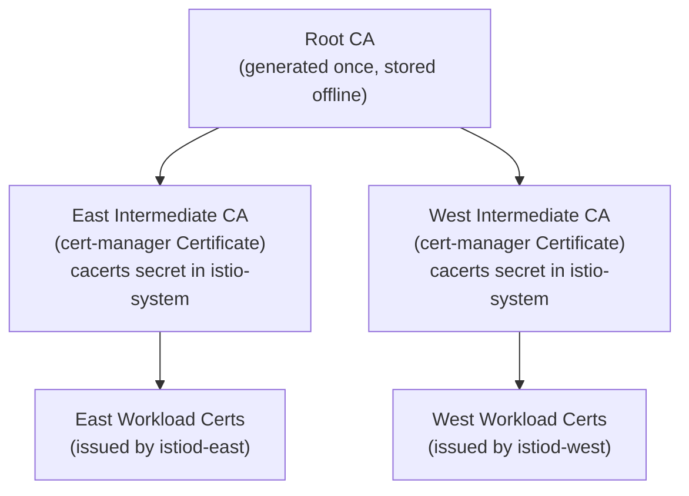
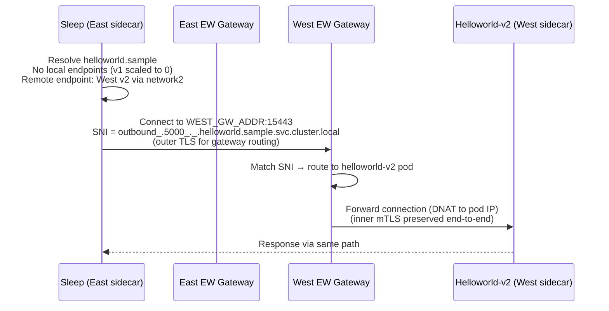
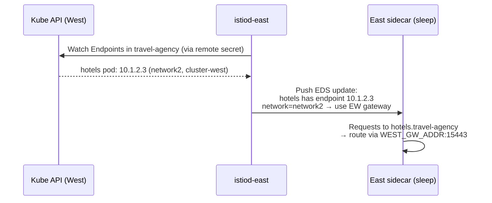
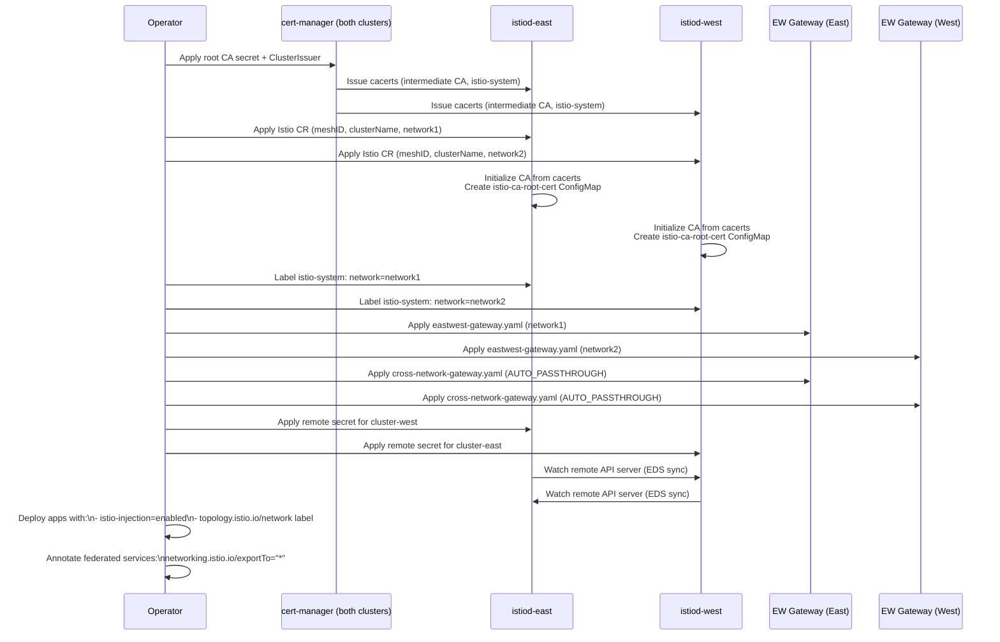

# Multi-Mesh Concepts: How OSSM Multi-Primary Multi-Network Works

This document explains the key concepts behind the multi-cluster Istio setup in this demo. It follows the deployment order and explains what each piece does and why it is needed.

---

## 1. Shared Certificate Authority

Both clusters must trust each other's workload certificates. Istio uses SPIFFE X.509 certificates for all sidecar-to-sidecar mTLS. If each cluster has its own independent CA, certificates issued by East will not be trusted by West and vice versa.

The solution is a shared root CA. cert-manager issues a unique intermediate CA per cluster (the `cacerts` secret in `istio-system`), but both intermediates are signed by the same root. Sidecars on both clusters therefore share a common trust anchor.



Istiod reads `cacerts` at startup and uses it to sign SPIFFE SVIDs for every pod in its cluster. Because the two intermediate CAs share a root, a West sidecar can validate a certificate presented by an East sidecar without any additional configuration.

**What breaks without this:** mTLS handshakes across clusters fail with certificate validation errors. Each cluster's sidecars will reject the other cluster's certificates.

---

## 2. Istio Control Plane Identity Settings

Each cluster's Istio CR includes three identity fields:

```yaml
values:
  global:
    meshID: mesh1           # same on both clusters
    multiCluster:
      clusterName: cluster-east   # unique per cluster
    network: network1             # unique per cluster
```

| Field | Scope | Purpose |
|---|---|---|
| `meshID` | Shared | Groups both clusters into one logical mesh. Used in telemetry and federation checks. |
| `clusterName` | Unique | Tags every endpoint registered by this istiod with the originating cluster. Istiod-east uses this to tell East's Envoys "this endpoint came from cluster-west." |
| `network` | Unique | Tags every endpoint with its network identity. Envoy uses this to decide whether it can reach an endpoint directly or must route through an east-west gateway. |

---

## 3. Discovery Scoping: `discoverySelectors`

`discoverySelectors` control which namespaces istiod watches:

```yaml
meshConfig:
  discoverySelectors:
    - matchLabels:
        istio-injection: enabled      # app namespaces
    - matchLabels:
        kubernetes.io/metadata.name: istio-system   # istiod's own namespace
```

The second selector is required because `istio-system` does not have `istio-injection: enabled`. Without it, istiod's namespace controller does not manage `istio-system`, and it will not create the `istio-ca-root-cert` ConfigMap there. Gateway pods mount this ConfigMap as a volume — if it is absent, the pod fails to start with `MountVolume.SetUp failed: configmap "istio-ca-root-cert" not found`.

---

## 4. Service Visibility Defaults

```yaml
meshConfig:
  defaultServiceExportTo: ["."]
  defaultVirtualServiceExportTo: ["."]
  defaultDestinationRuleExportTo: ["."]
  trustDomain: cluster.local
```

`"."` means the same namespace. These settings make all services and Istio config **private by default** — a VirtualService in `travel-agency` only affects traffic within `travel-agency`, not across the whole mesh.

This is the recommended production default. It prevents namespace-level config from accidentally affecting other teams' services.

**The consequence for the east-west gateway:** The gateway pod runs in `istio-system`. If a service has `exportTo: ["."]` (the default), istiod does not push xDS configuration for it to the gateway pod. The gateway has no listener for it on port 15443 and cannot route cross-cluster traffic to it.

**The fix:** Any service that must be reachable across clusters must explicitly opt in:

```bash
oc annotate svc hotels -n travel-agency \
  networking.istio.io/exportTo="*" --overwrite
```

`trustDomain: cluster.local` is the SPIFFE trust domain. Workload identities look like `spiffe://cluster.local/ns/<ns>/sa/<sa>`. Using the same value on both clusters means `AuthorizationPolicy` rules referencing a remote identity work without trust domain aliases.

---

## 5. East-West Gateway and SNI-DNAT

The east-west gateway is an Envoy proxy (deployed as a standard Kubernetes Deployment) that bridges the two separate cluster networks. It listens on port 15443 and routes cross-cluster traffic using **SNI-DNAT**.

### How a cross-cluster call works



**Key details:**

- East's Envoy wraps the call in an outer TLS layer, setting the SNI to encode the destination service name
- West's EW gateway reads the SNI and NATs the connection to the actual pod — it does **not** terminate the inner mTLS between the two sidecars
- End-to-end mTLS is preserved: the certificates exchanged are between East's sleep sidecar and West's helloworld sidecar, not involving the gateway at all

The `ISTIO_META_ROUTER_MODE: sni-dnat` environment variable on the gateway pod enables this routing behavior. The `Gateway` CR with `protocol: TLS` and `tls.mode: AUTO_PASSTHROUGH` tells Envoy to accept any `*.local` SNI on port 15443 and pass it through.

### Network label and endpoint filtering

The gateway has `ISTIO_META_REQUESTED_NETWORK_VIEW: network2` (for West). This tells istiod: "only push endpoints that are on network2 to this gateway." Endpoints acquire their network tag from the namespace label `topology.istio.io/network`. Every application namespace must carry this label:

```bash
oc label namespace travel-agency topology.istio.io/network=network2 --overwrite
```

If the label is missing, the endpoint has no network tag and is invisible to the remote gateway — cross-cluster traffic fails with a connection reset.

---

## 6. Cross-Cluster Endpoint Discovery

Each istiod needs to know about pods running in the other cluster. `istioctl create-remote-secret` generates a kubeconfig (stored as a secret in `istio-system`) that grants istiod API server access to the remote cluster:



Without this secret, East's istiod has no knowledge of West's pods. East's sidecars see zero endpoints for `hotels` and fail with "no healthy upstream."

---

## 7. Complete Setup Sequence



---

## 8. Summary: What Each Requirement Does

| Requirement | Where | What breaks without it |
|---|---|---|
| Shared root CA → `cacerts` secret | `istio-system` both clusters | Cross-cluster mTLS cert validation fails |
| `discoverySelectors` includes `istio-system` | Istio CR | `istio-ca-root-cert` ConfigMap not created; gateway pods fail to start |
| `topology.istio.io/network` on `istio-system` | Namespace label | EW gateway pod has no network identity; gateway listeners not created |
| `topology.istio.io/network` on app namespaces | Namespace label | Endpoints have no network tag; invisible to remote EW gateway |
| `networking.istio.io/exportTo: "*"` on federated services | Service annotation | istiod does not push xDS for the service to the gateway pod in `istio-system`; port 15443 has no listener for the service |
| `cross-network-gateway.yaml` (AUTO_PASSTHROUGH) | `istio-system` both clusters | EW gateway has no rule to accept port 15443 SNI traffic |
| Remote secrets | `istio-system` both clusters | istiod cannot watch remote cluster; zero remote endpoints seen by local sidecars |
